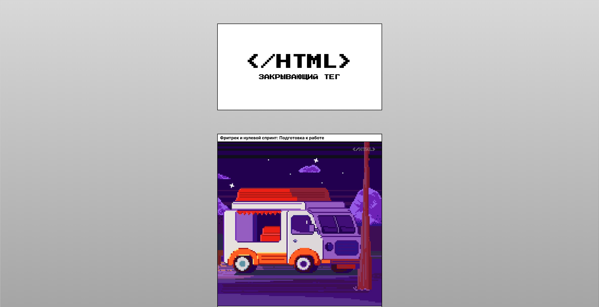
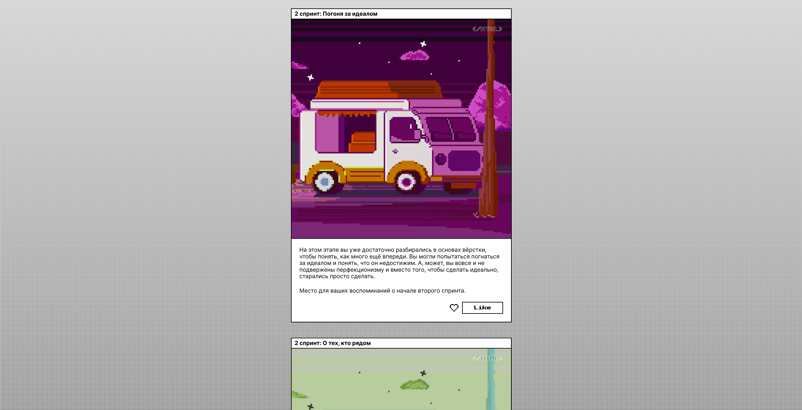
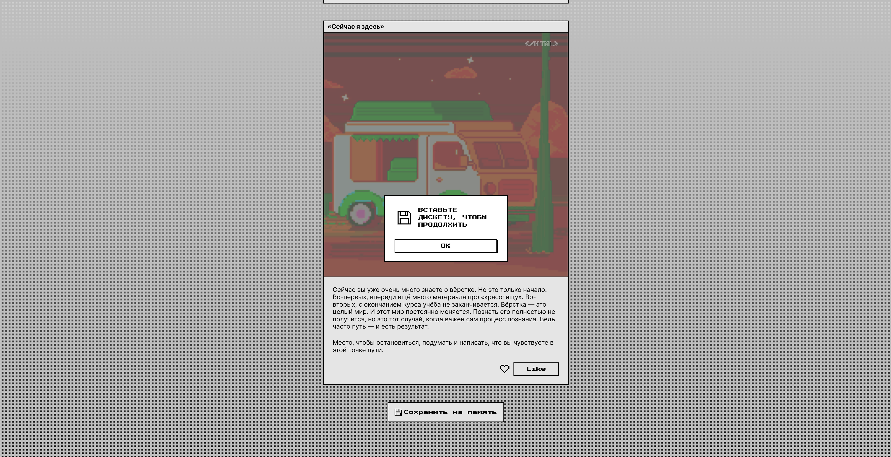

https://github.com/lamayade/zakrivayuschiy-teg-f.git
https://lamayade.github.io/zakrivayuschiy-teg-f/

# &lt;/HTML&gt;
## Сайт-ретроспектива обучения основам HTML и CSS
Проект страницы сайта об этапах обучения, сложностях и перспективах. Реализовано адаптивное разрешение для мобильного устройства и десктопа. Поддерживаются анимации иконок и кнопок, реализовано диалоговое окно.

## Технологии
__HTML__  
__CSS__  
__JavaScript__

## Как развернуть проект локально
Форкнуть и клонировать репозиторий:

```bash
git clone https://github.com/ваш_логин_на_гитхабе/zakrivayuschiy-teg-f.git
```

Перейти в папку проекта:

```bash
cd zakrivayuschiy-teg-f
```

Открыть файл `index.html` в браузере.

## Скриншоты


